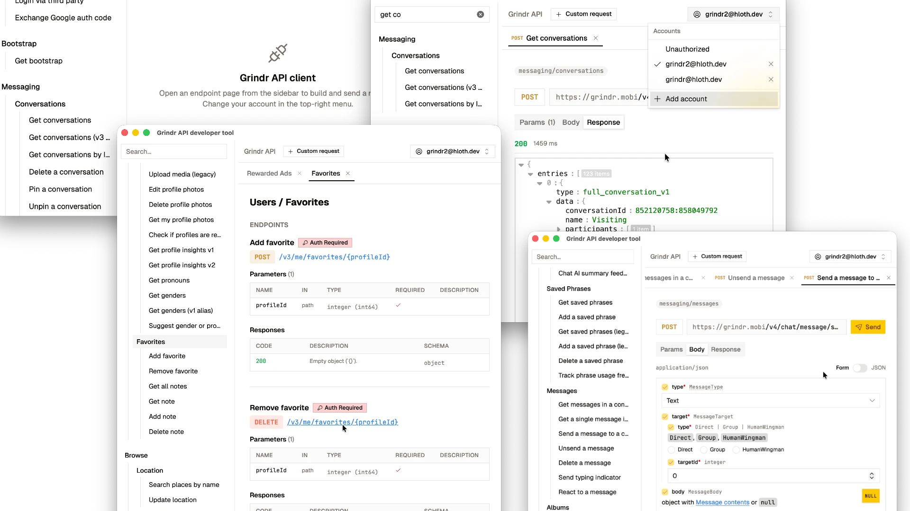

# Grindr API developer tool

GUI client for Grindr API, built with Rust and Tauri.

- Schema (endpoints, query, body, parameters) are pulled from <https://opengrind.org/openapi.json>
- Correct User-Agent and security headers are handled automatically
- Documentation built-in, matching docs at <https://opengrind.org/docs>
- Multi-tab views for multiple requests at once

[Download from releases](https://git.opengrind.org/open-grind/grindr-api-dev-tool/releases)

Powered by [Grindr.rs](https://git.opengrind.org/open-grind/grindr.rs), made for [Open Grind](https://opengrindr.org)

## License

[MIT](./LICENSE)