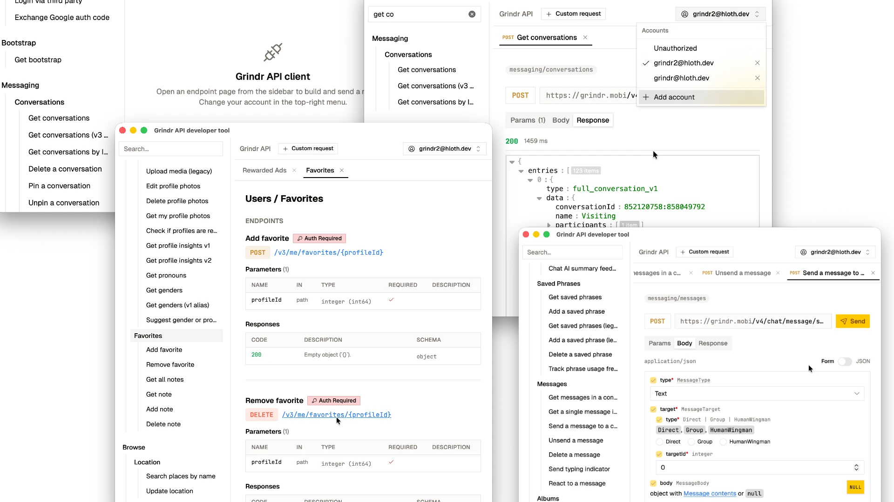

# Grindr API developer tool

GUI client for Grindr API, built with Rust and Tauri.

- Schema (endpoints, query, body, parameters) are pulled from <https://opengrind.org/openapi.json>
- Correct User-Agent and security headers are handled automatically
- Documentation built-in, matching docs at <https://opengrind.org/docs>
- Multi-tab views for multiple requests at once

[Download from releases](https://git.opengrind.org/open-grind/grindr-api-dev-tool/releases)

Powered by [grindr.rs](https://git.opengrind.org/open-grind/grindr.rs), made for [Open Grind](https://opengrindr.org).

## License

Code: [MIT](./LICENSE)

Logo, icons and screenshot (`contrib/`, `src-tauri/icons/`): [CC0 1.0](https://creativecommons.org/publicdomain/zero/1.0/) (public domain). The screenshot also shows [Phosphor Icons](https://phosphoricons.com), Copyright (c) 2020 Phosphor Icons, under the MIT License
